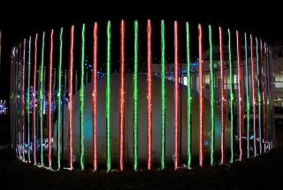

<section id="１研究目的、研究方法など">
<section id="(概要)">

本研究の目的は、象の卵を発見して、象の卵生を証明することである。
進化論的には、象は卵を産む方が自然である。

	世界の動物園や、アフリカ、インドで
	空と陸の両面から多角的に探索を行う。
	象の卵を発見した場合は、
	その形状の測定、材質の解析、工学的応用の可能性の検討を行う。

</section>
<section id="(本文)">

**
＊＊＊　以下は、あくまで例です。真似しないでください。　＊＊＊  
＊＊＊　本文はもちろん、節の切り方や論理の組み方は　　　＊＊＊  
＊＊＊　ご自分の気に入ったスタイルで書いてください。　　＊＊＊
**

### なぜ象は卵を産むはずか

今まで、哺乳類である象は卵を産まないとされてきた。
しかし、哺乳類の定義は乳を与える動物のことであり、
必ずしも胎盤を持ち母親の体内で成長させる動物であるとは限らない。
たとえばカモノハシは卵を産むし、カンガルーは体外の袋の中で新生児を育てる。
哺乳類の動物が胎生か卵胎生か卵生かは、進化上の分類よりもむしろ、生活の環境によって決まる。
象のように大きく強い動物の場合、重たい象の胎児を運ぶよりは、
卵を産んでその重さから解放される方が楽である。
また卵が大きく硬い殻でできていれば、他の動物に取られたり食べられたりする恐れもない。
さらに食物を求めて象の群れが移動するときも、長い鼻で丸い卵を転がして行った方が、
胎児を持ち運ぶよりエネルギー効率が高い。
（恐竜も卵を産んだが、長い鼻を持たず、車輪を考案するだけの脳を持たなかったため、巣を作った）
こうした点から、象は卵を産む方が進化論的に自然である。

### 象など大型哺乳類の卵は今まで見つかってないのか

寺村輝夫の研究[^teramura]によれば、昔、
王子の誕生を祝って国民全員に卵焼きを提供すべく、
軍隊を動員して象の卵を探させた王がいた。
このときは孵化直後の子象は見つかったが、それが入っていた殻の発見には至っていない。

また、私は今まで地球上で最大の哺乳類であるシロナガスクジラの卵の探索を行ってきた。
まだ発見には至っていないが、海水単位体積あたりの存在確率の上限値を与えた(私の業績リストの中の[\ref{pub:whale}])。

### 今こそ、枠を越えた自由な発想を

今まで、我々研究者は分野や古い学説など様々な枠にとらわれてきた。
しかし今や、科研費の書類では全体を囲む枠が取り払われたのみならず、
研究目的、背景、方法などの間の枠も取り除かれた。
これにより我々研究者は、自分の主張を、細切れにされることなく、
自分の論理的な道筋に従って書類に書ける自由を得た。
しかし逆に言えば、一目で数ページの中のどこに何が書いてあるのかがわかる
文章を書くことが重要である。
そのためには、論文など論理的な文章を書くときに使い慣れた\LaTeX を用いるのが楽である。

書類の枠から解放された今、象=胎生という<u>常識の枠</u>からも我々は解放され、
より**自由な発想**をするべきである。

**ん？？この研究の目的が何か、どこでも言ってないぞ。。。**

### どうやって探すか

予算と時間は限られているため、確率と効率を考慮し、
次のような順序で象の卵を探索する。

1. 逢坂北部のある終点駅の駅前では、
   毎年年末になると図\ref{fig:egg_R}、図\ref{fig:egg_L}に示すように
   コンクリートでできた象の卵の像のまわりを電飾するしきたりが残っている。
   (少し寄り目にし、右目で左の図、左目で右の図を見てください。
   なお、このように図や表を横に並べる方が、`wrapfigure`を用いるより位置の調整が楽です。)
   まずは超音波を使い、このコンクリートの内側に化石化した象の卵が実は隠されていないか、
   調査する。

   {style="width:49%;"} {style="width:49%;"}

2. 世界の動物園を巡り、
   象舍の藁の山の中に卵が隠されていないか、探す。
   これは藁の山の中から針を探すより楽である。

3. 見通しの効くアフリカのサバンナで、宇宙と地上から象の卵を探す。
   定期的に撮った写真を比較する、超新星探索と同じ画像処理を衛星写真に対して行えば、
   効率的に広範囲の探索ができる。
   象の卵の候補が見つかったら、ハッブル望遠鏡をその方向に向けて写真を撮り、
   現地調査に向かうべきかどうかを判定する。

4. インドとタイに行き、ジャングルに隠されている卵を探す。
   ジャングルの場合空からは探しにくいが、象使いも多く、象の背中に乗って
   象の視点から探索することができる。
   さらに、気性の荒いアフリカ象と異なり、気だての優しいインド象ならば
   卵の在処を教えてくれる可能性もある。
   子供時代、象と散歩をした経験があるので[^inTheForest]、
   すぐに象と仲良くなれると思う。

### この研究の売り

本研究は次のような特徴を持つ。

* 象が卵を産むなどという考えは**創造的**(想象的)である。
* 象の卵を探索しようとする研究は現在世界中で他になく、**独創的**である。
  従って私がこの分野の第一人者（一人者：ひとりもの?）である。
* 身近すぎてつい見逃しがちな箇所の探索、最新の映像や画像技術を駆使した探索、
  象の優しさを活用した探索など、多方面からの探索である。

### 象の卵を発見したら

{style="width:5cm;"}

象の卵を発見したら、次のことを行う。

#### 外形の計測

外形を計測し、それが
絶対的な卵の形の枠である
アルキメデス($'A\rho\chi i\mu\acute{\eta}\delta\eta\mbox{\c{c}}$)の
円筒座標表示形(式(1))と一致するかどうか調べる。
もし一致していなければ、卵でない可能性がある。

$$
	\tag{1}
	r(z) = 0.5\sqrt{1-(e^z-2)^2}
$$

#### 殻の化学構造の解明

殻の化学的構造を解析し、その強さの秘密を解明する。
象の卵の殻は、80kgを超える体重の子象と、
その栄養源である卵黄の大きな質量を支えるだけではなく、
卵を暖める親の象の体重も支える必要がある。
このため、象の卵の殻は、体重の軽い鳥類(図[^fig:seagull])の卵の殻とは
本質的に異なる構造を持っていると考えられる。
化学的構造が解明できれば、それを人工的に合成して新たな自動車や飛行機の
ボディに利用できる。

### 参考文献

[^teramura]: 寺村輝夫、「ぼくは王様 - ぞうのたまごのたまごやき」.
[^inTheForest]: マリー・ホール・エッツ、「もりのなか」.
[^fig:seagull]:

</section>
</section>

<section id="２応募者の研究遂行能力及び研究環境">

### 応募者の研究遂行能力及び研究環境

応募者は過去20年間、７つの海を隅から隅まで航海し、
浅瀬から深海まで潜り、文字通り東西南北上下の３次元で
シロナガスクジラの卵の探索を行ってきた(業績\ref{pub:whale})。		% 業績の表示
シロナガスクジラに飲み込まれそうになったり、海賊に捕まるなどの危険な目にも
あったが、それにもめげず、研究を遂行してきた強靭な能力を有する。

シロナガスクジラの卵を探すために用いていたソナーと双眼鏡、及び
シロナガスクジラの卵を引き上げるために用意していた大きな網は、
そのまま使える。

### 研究業績リスト

1. \paper{Search for whale eggs}{\yukawa\ \etal}{Rev.\ Oceanic Mysteries}{888}{99}{2017}\label{pub:whale}
2. \paper{Theory of Elephant Eggs}{\yukawa, Kara Juzo \etal}{\prl}{800}{800-804}{2005}\label{pub:theoegg}
3. \paper{仔象は死んだ}{Kobo Abe}{安部公房全集}{26}{100-200}{2004}
4. \paper{The Elephant's Child (象の鼻はなぜ長い)}{R.~Kipling}{Nature}{999}{777-799}{2003}
5. \paper{You can't Lay an Egg If You're an Elephant}{F.~Ehrlich}{JofUR\\({\tt www.universalrejection.org})}{{\bf N/A}}{2002}
<!-- 下のように書いてもいいけど、めんどくさいし、表示の仕方を変えようとしたら大変。 -->
6. ``Egg of Elephant-Bird'', <u>A.~Cooper</u>, Nature, **409**, 704-707 (2001).
{{! input(jack_pub.tex) }}

</section>

<section id="３人権の保護及び法令等の遵守への対応">

象の卵のES細胞の培養、象のクローンの生成などは行わない。
象個体を現地から持ち出すことはないので、ワシントン条約ならびに
生物多様性条約に抵触しない。また、組換え実験は行なわないので、
カルタヘナ議定書にも抵触しない。

\noindent
\rule{\linewidth}{1pt}
\linenumbers
\subsection{ついでに\LaTeX の便利な機能}
\subsubsection{節}
通常通り\textbackslash subsection, \textbackslash subsubsectionなどが使えます。
番号は自動的につきます。

\subsubsection*{番号なし節}
\textbackslash subsubsection* のように* 付きを使うと、節の番号がつきません。

\subsubsection{コメント文}
%う〜ん、これ言おうか言わまいか迷てんねんけどな、
%言うのも何やし、言わへんのもどうかと思うし、どうしようかなあ．．．．
\LaTeX では当たり前ですが、
今はとりあえず消すけど使う可能性のある文章は、
消さずに行の頭に \% をつけてコメントアウトすると、後で復活できます。
\texttt{TeXShop}や\texttt{TeXWorks}では、複数行選んでまとめてコメントにしたり
コメントから外したりできます。

\subsubsection{編集用の行番号}
\texttt{lineno}というパッケージを使えば、
\textbackslash linenumbersと\textbackslash nolinenumbersの間の行に行番号が振られます。
これは編集中に他の人からコメントをもらうときに便利です。\\
\textbf{最終版のPDFを作る前に、行番号は消してください。}

\subsubsection{編集用の欄外のメモ}
\textbackslash memo{}を使うと右の例のように、欄外にメモを書けます。\\
\memo{欄外メモ\\だよ}
\textbf{最終版のPDFを作る前に、\LaTeX ソースファイルの60行目付近にある指示に従って、}
\textbackslash memo \textbf{を無効化してください。}

\nolinenumbers

</section>

<section id="４研究計画最終年度前年度応募を行う場合の記述事項">

\newcommand{\最終年度研究種目名}{基盤研究（Z）}
\newcommand{\最終年度研究課題番号}{99999}
\newcommand{\最終年度研究課題名}{シロナガスクジラの卵はなぜ見つけられないのか}
\newcommand{\最終年度研究期間}{平成25年度〜令和\一年目 年度}

<section id="当初研究計画及び研究成果">

研究課題の通り、シロナガスクジラの卵は見つけられなかった。

</section>
<section id="前年度応募する理由">

さっさと次の研究に移りたいので。

</section>
</section>
